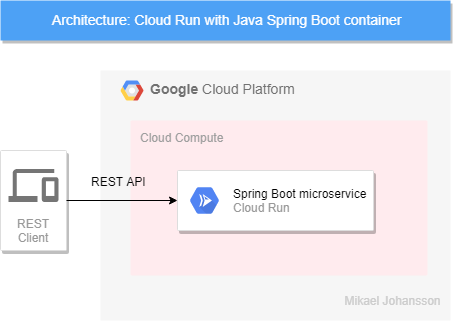

# Example of GCP Cloud Run with a microservice in a container

This is an example how to build and deploy a Java Spring Boot microservice with a REST API as a container to GCP Cloud Run.



# Setup development environment in Windows
* Download and install [Maven](https://maven.apache.org/download.cgi)
* Download and install [Make](http://gnuwin32.sourceforge.net/packages/make.htm)
* Install [Docker Desktop](https://www.docker.com/products/docker-desktop)

# Build the container

# Setup GCP
Follow https://cloud.google.com/run/docs/quickstarts/build-and-deploy. Here are a summary of the steps:

* Create a GCP account and login
* Register your application for Cloud Build API, Cloud Run API in Google Cloud Platform
* Install the latest Cloud SDK version: https://cloud.google.com/sdk/docs/
* Update the SDK: gcloud components update
* Create a project
* Enable billing and link billing account to the project in order to use Cloud Build

# Getting started
* Build microservice and it's container: ```make build```
* Send container to Container Registry and deploy to Cloud Run: ```make deploy```
* Access your API through the URL that will be printed out from the gcloud run deploy command
* View your Cloud Run service at the [Cloud Console](https://console.cloud.google.com/run)

# FAQ

How to handle "java.lang.IllegalArgumentException: Invalid character found in method name. HTTP method names must be 
tokens"?

Means that your browser/client tries to send HTTPS to your service that only accept HTTP. Change to http:// and empty 
cache and reload.


# License
There is no license. Please enjoy!

Best regards Mikael, https://www.linkedin.com/in/the-mikael-johansson/