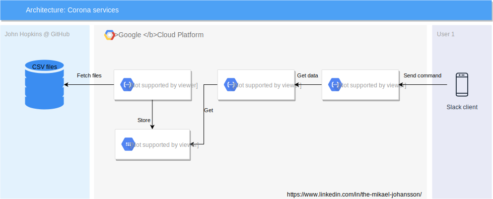

# Corona services

Contains the following services:

- corona-mirrorer - Fetches Corona statistics from John Hopkins University and stores it into a Firestore database (running in Datastore mode).

- corona-source - Provides an API for queringen of country statistics

- corona-slack-bot - Fetches data from corona-source and presents it into Slack channels/private messages.



## Known issues

Both corona-source and corona-slack-bot are deployed as cloud functions and have very often cold boots that exceeds Slack's limit of 3 seconds. A permanent service without cold boots would solve the issue. Currently the requests takes 1,5 s - 11 s.

## Build and deploy

- Create your own GCP Project in GCP Console

- Login to your project on your computer (gcloud auth login)

- Read the README.md for each service (some require manual configuration)

- Run ```make deploy-all```


## Good commands

```
gcloud auth login

gcloud projects list

gcloud config set project rest-api-271820

gcloud functions deploy corona-source \
        --entry-point app \
        --source src/ \
        --runtime nodejs8 \
        --trigger-http \
        --allow-unauthenticated
```

# Running locally

Download an account with access to the database and store it as credentials.json in the app root.

From terminal set the following environment variable:
```
export GOOGLE_APPLICATION_CREDENTIALS=./credentials.json
```

# Purpose

Educational and research.
